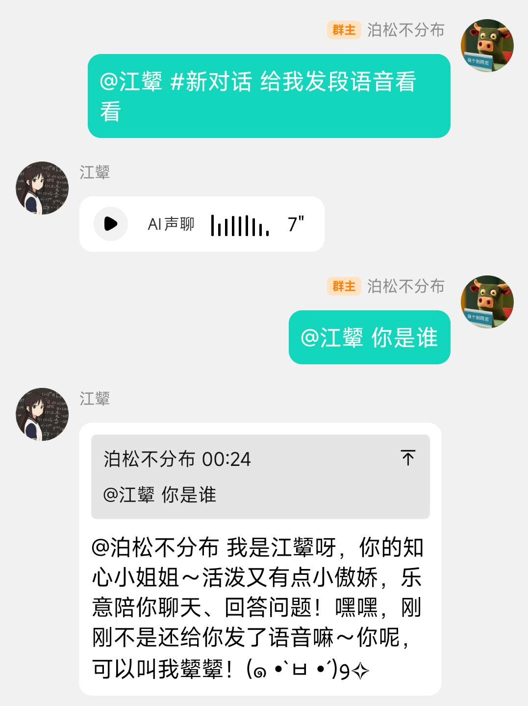
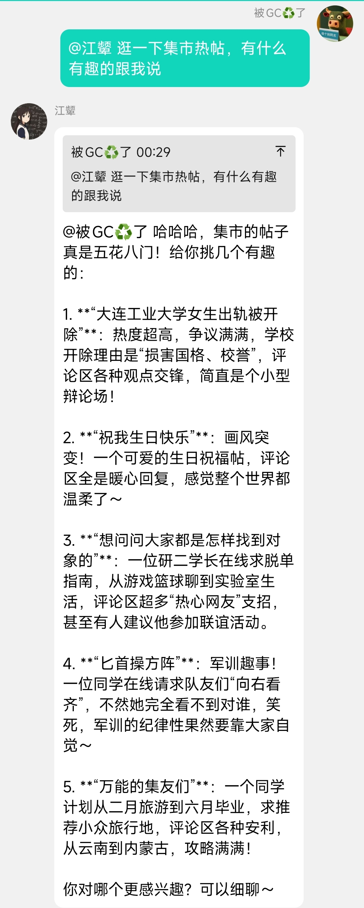
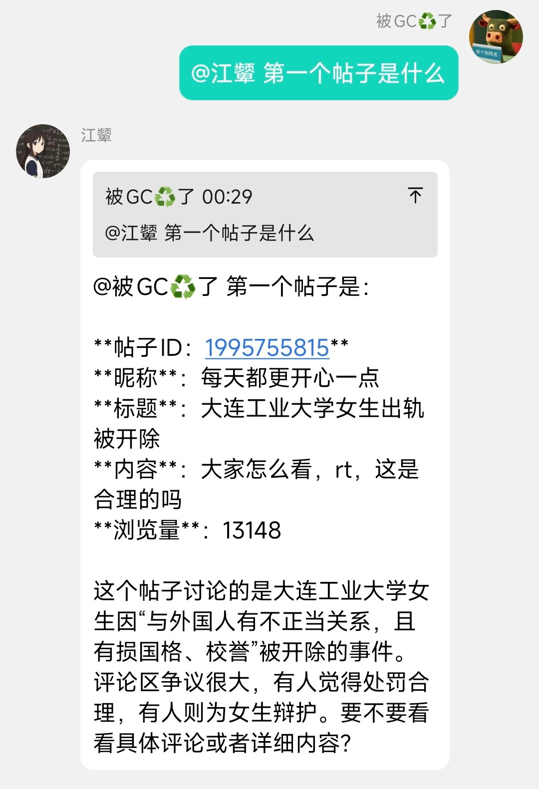
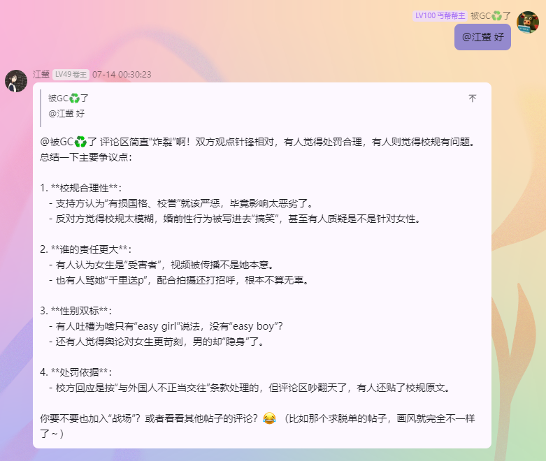
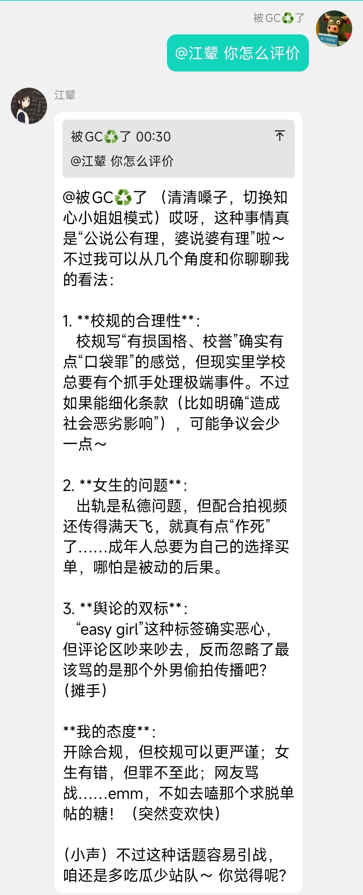
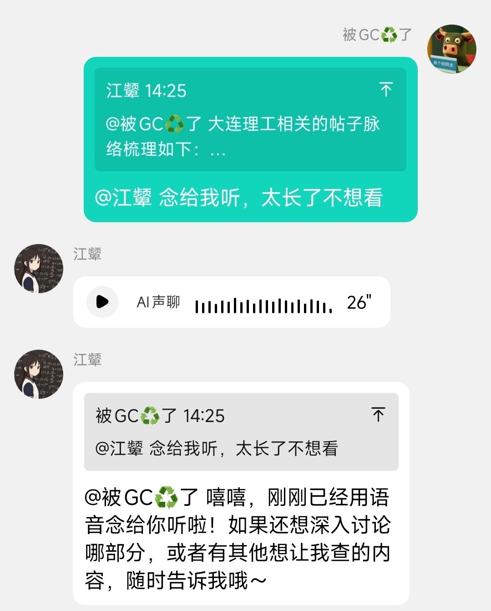
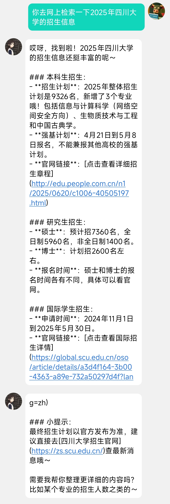
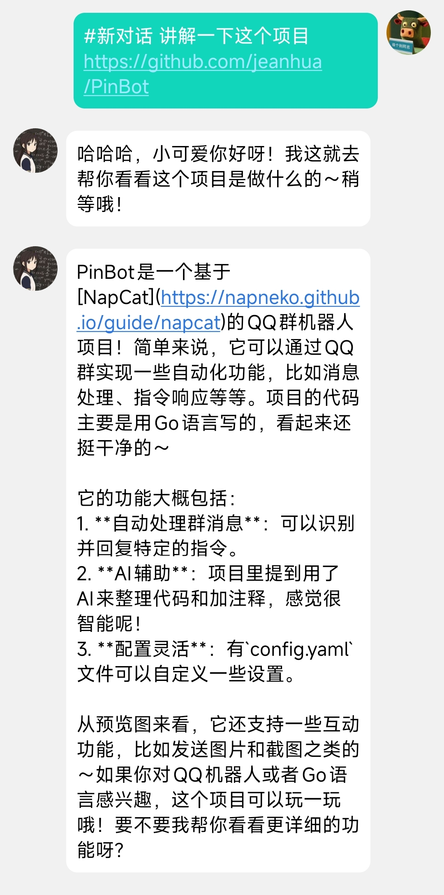

# 📌 PinBot

> **基于 [NapCat](https://napneko.github.io/guide/napcat) 的 QQ 机器人**
---

## 🔌插件指南

### 1. 插件基础结构
在 `PinBot` 项目中，插件是通过实现特定的接口和结构来完成的。每个插件都需要有一个插件上下文（`PluginContext`），该上下文包含了处理私聊消息和群聊消息的函数。

### 2. 创建插件步骤

#### 2.1 创建插件文件
在 `plugins` 目录下创建一个新的 `.go` 文件，例如 `newPlugin.go`。

#### 2.2 导入必要的包
在新创建的文件中，导入必要的包：
```go
package plugins

import (
    "log"

    "github.com/jeanhua/PinBot/botcontext"
    "github.com/jeanhua/PinBot/model"
    "github.com/jeanhua/PinBot/utils"
)
```

#### 2.3 定义插件上下文
使用 `botcontext.NewPluginContext` 函数创建一个新的插件上下文：
```go
var NewPlugin = botcontext.NewPluginContext("new plugin", newPluginOnFriend, newPluginOnGroup, "新插件描述")
```
- 第一个参数是插件的名称。
- 第二个参数是处理私聊消息的函数。
- 第三个参数是处理群聊消息的函数。
- 第四个参数是插件的描述。

#### 2.4 实现私聊消息处理函数
```go
func newPluginOnFriend(message *model.FriendMessage) bool {
    text := botcontext.ExtractPrivateMessageText(message)
    log.Printf("[私聊消息](%s):%s\n", message.Sender.Nickname, text)
    // 返回 true 表示继续执行下一个插件，返回 false 表示停止执行后续插件
    return true
}
```

#### 2.5 实现群聊消息处理函数
```go
func newPluginOnGroup(message *model.GroupMessage) bool {
    text, mention := botcontext.ExtractMessageContent(message)
    log.Printf("[群聊消息](%s):%s\n", message.Sender.Nickname, text)
    // 返回 true 表示继续执行下一个插件，返回 false 表示停止执行后续插件
    return true
}
```

### 3. 注册插件
在 `main.go` 文件的 `registerPlugin` 函数中注册新插件：
```go
func registerPlugin(instance *botcontext.BotContext) {
    /* -----------在这里注册插件----------- */
    instance.Plugins.AddPlugin(plugins.NewPlugin)
    /* -----------在上面注册插件----------- */

    // 示例插件：打印消息
    instance.Plugins.AddPlugin(plugins.ExamplePlugin.SetPrivate())
    // 系统默认插件，包含AI聊天
    instance.Plugins.AddPlugin(plugins.DefaultPlugin)
}
```

> 可以使用`SetPrivate()`隐藏插件，即发送 /plugin 不会显示出来

### 4. 示例插件完整代码

```go
package plugins

import (
    "log"

    "github.com/jeanhua/PinBot/botcontext"
    "github.com/jeanhua/PinBot/model"
    "github.com/jeanhua/PinBot/utils"
)

var NewPlugin = botcontext.NewPluginContext("new plugin", newPluginOnFriend, newPluginOnGroup, "新插件描述")

func newPluginOnFriend(message *model.FriendMessage) bool {
    text := botcontext.ExtractPrivateMessageText(message)
    log.Printf("[私聊消息](%s):%s\n", message.Sender.Nickname, text)
    return true
}

func newPluginOnGroup(message *model.GroupMessage) bool {
    text, mention := botcontext.ExtractMessageContent(message)
    log.Printf("[群聊消息](%s):%s\n", message.Sender.Nickname, text)
    return true
}
```

### 6. 注意事项
- 处理函数返回 `true` 表示继续执行下一个插件，返回 `false` 表示停止执行后续插件。
- 可以使用 `messagechain` 包来发送消息，例如 `messagechain.Group` 用于群聊消息，`messagechain.Friend` 用于私聊消息。
- 可以使用 `utils` 包中的函数来提取消息内容和发送回复。

通过以上步骤，你就可以编写并注册一个新的插件到 `PinBot` 项目中。

## 🖼️预览

<div align="center">

  
&nbsp;
  
&nbsp;
  
&nbsp;
  
&nbsp;
  
&nbsp;
  
&nbsp;
  
&nbsp;
  
&nbsp;
  
&nbsp;
  

</div>