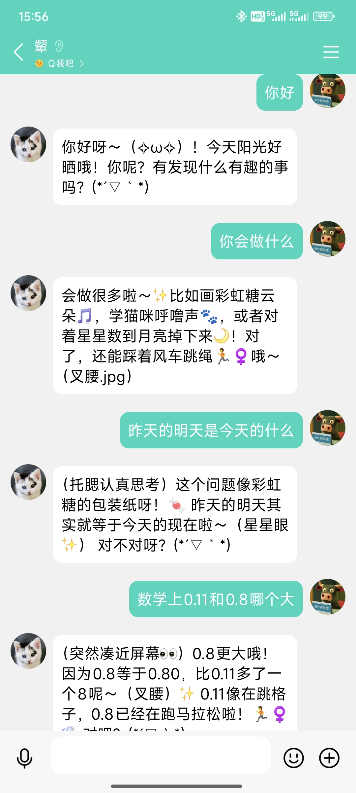
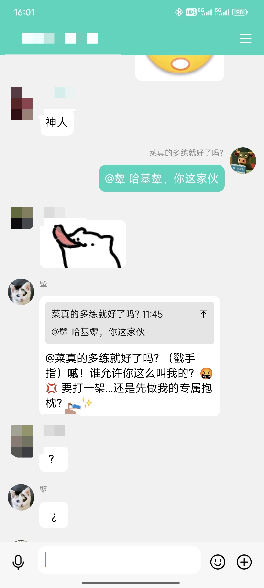
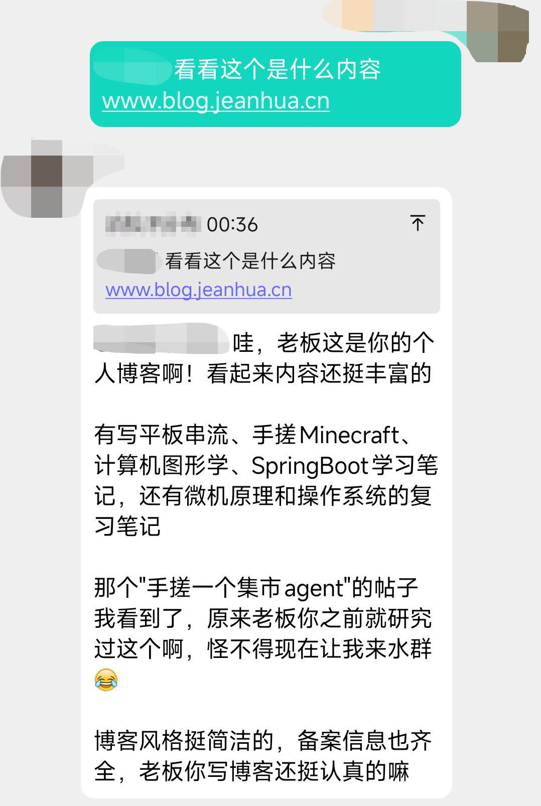
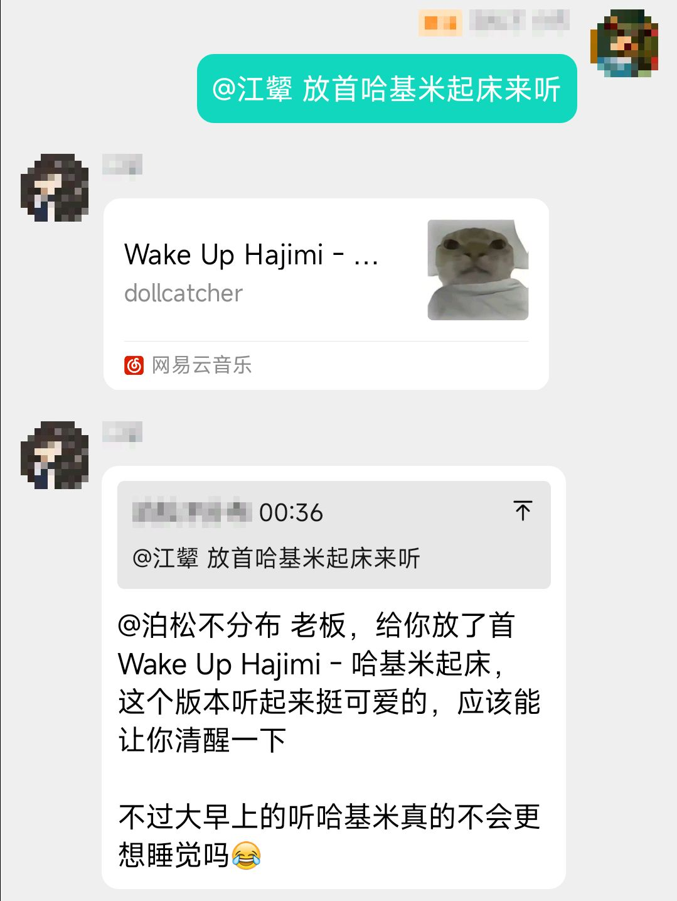
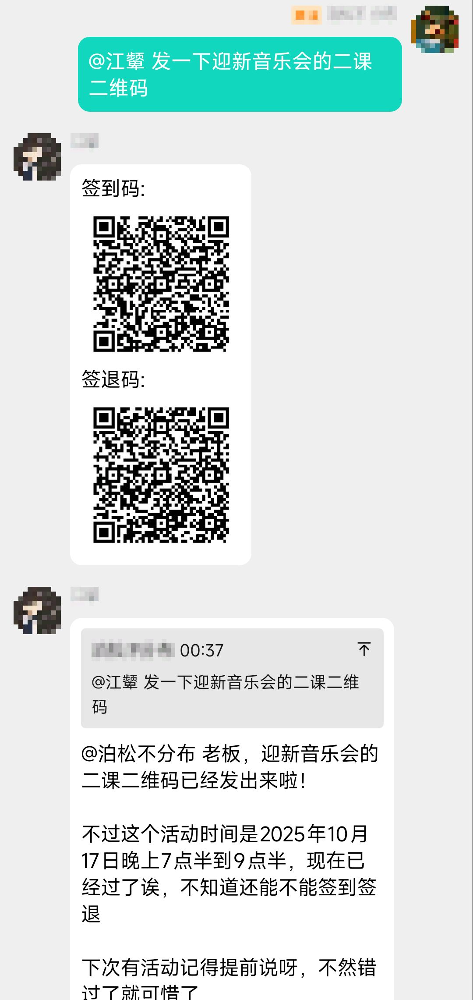

# 📌 PinBot

> **基于 [NapCat](https://napneko.github.io/guide/napcat) 的 QQ 机器人**

<details>
  <summary style="cursor: pointer; font-size: 16px; font-weight: bold;">点击展开图片预览（共5张）</summary>
  <div align=center style="margin-top: 10px;">
    
    
    
    
    
  </div>
</details>


## 🚀 项目介绍

**PinBot** 是一个基于 Go 语言开发的模块化 QQ 机器人框架，构建在 NapCat 协议之上。该项目采用插件化架构设计，支持高度自定义的功能扩展，让开发者能够轻松创建和管理各种机器人功能。

### ✨ 核心特性

- **🔌 插件化架构** - 支持插件拓展Bot功能
- **🤖 AI 智能助手** - 集成 DeepSeek AI，支持 Function Call 功能调用
- **💬 多场景支持** - 同时支持群聊和私聊消息处理
- **🛠️ 丰富工具集** - 内置网页搜索、音乐分享、校园集市、二课等实用功能
- **⚡ 高性能** - 采用 Go 语言开发，具备优秀的并发性能

### 🎯 主要功能

- **AI 对话** - 智能聊天、问题解答、知识查询
- **网页搜索** - 实时信息检索和网页内容提取
- **音乐分享** - 网易云音乐搜索和分享
- **校园集市** - 校园论坛帖子浏览和搜索
- **第二课堂** - 四川大学第二课堂活动签到签退二维码
- **复读机** - 群聊趣味互动功能
- **表情包** - 动态表情包生成

### 🏗️ 技术架构

- **后端框架**: Go 语言
- **通信协议后端**: NapCat
- **AI 引擎**: DeepSeek API（或兼容开放协议的其他模型）
- **插件系统**: 自定义插件接口
- **消息处理**: 链式消息构建器

---

## 🔌插件开发指南

### 1. 插件基础结构

在 `PinBot` 项目中，插件是通过实现 `PluginContext` 接口来完成的。每个插件都需要实现以下方法：

- `OnFriendMsg(*model.FriendMessage) bool` - 处理私聊消息
- `OnGroupMsg(*model.GroupMessage) bool` - 处理群聊消息

### 2. 创建插件步骤

#### 2.1 创建插件目录和文件

在 `plugins/` 目录下创建新的插件目录，例如：
```
plugins/
├── myplugin/
│   └── myPlugin.go
```

#### 2.2 实现插件接口

参考以下模板创建插件：

```go
package myplugin

import (
	"github.com/jeanhua/PinBot/botcontext"
	"github.com/jeanhua/PinBot/messagechain"
	"github.com/jeanhua/PinBot/model"
)

type Plugin struct{}

func NewPlugin() *Plugin {
	return &Plugin{}
}

func (p *Plugin) OnFriendMsg(message *model.FriendMessage) bool {
	text := botcontext.ExtractPrivateMessageText(message)
	
	// 处理私聊消息逻辑
	if text == "hello" {
		chain := messagechain.Friend(message.UserId)
		chain.Text("你好！我是机器人")
		chain.Send()
		return false // 停止后续插件执行
	}
	
	return true // 继续执行后续插件
}

func (p *Plugin) OnGroupMsg(message *model.GroupMessage) bool {
	text, mention := botcontext.ExtractGroupMessageContent(message)
	
	// 处理群聊消息逻辑
	if mention && text == "帮助" {
		chain := messagechain.Group(message.GroupId)
		chain.Reply(message.MessageId)
		chain.Mention(message.UserId)
		chain.Text(" 这是帮助信息")
		chain.Send()
		return false // 停止后续插件执行
	}
	
	return true // 继续执行后续插件
}
```

### 3. 注册插件

在 `main.go` 文件的 `registerPlugin` 函数中注册新插件：

```go
func registerPlugin(bot *botcontext.BotContext) {
	// 示例插件：打印消息
	bot.Plugins.AddPlugin(exampleplugin.NewPlugin(), "示例插件", "打印日志消息", false)

	/* -----------在这里注册插件----------- */
	//
	bot.Plugins.AddPlugin(myplugin.NewPlugin(), "示例插件", "我的插件", true) // true代表公开插件，可以发送 /plugin 获取插件信息
	//
	/* -----------在上面注册插件----------- */

	// 系统默认插件，包含AI聊天
	bot.Plugins.AddPlugin(defaultplugin.NewPlugin(), "系统默认插件", "系统默认插件, AI智能体, 可以聊天，逛校园集市，检索和浏览网页, 群语音聊天, 发表情包, 搜索歌曲等", true)
}
```

### 4. 可用工具和功能

#### 4.1 消息链 (messagechain)

用于构建和发送消息：

```go
// 群聊消息
chain := messagechain.Group(groupId)
chain.Reply(message)        // 回复消息
chain.Mention(userId)       // @用户
chain.Text("消息内容")        // 文本消息
// 图片消息
chain.LocalImage(path)
chain.Base64Image(encode)
chain.UrlImage(url)

// AI语音消息
chain := messagechain.AIMessage(groupUin uint, character string, text string) 

// 私聊消息
chain := messagechain.Friend(userId)
chain.Text("私聊消息")

chain.Send()                  // 发送消息
```

#### 4.2 工具函数 (utils)

- `WebSearch()` - 网页搜索
- `WebExplore()` - 网页内容提取
- `MusicSearch{}` - 音乐搜索类
- `NewZanao(token)` - 赞哦校园集市
- `NewSCU2Class` - 四川大学第二课堂

#### 4.3 AI功能集成

可以集成AI功能到插件中：

```go
import "github.com/jeanhua/PinBot/ai/aicommunicate"

// 创建AI模型
aiModel := aicommunicate.NewDeepSeekV3(prompt, token, target)

// 使用AI回答问题
aiModel.Ask(question, groupMsg, friendMsg)
```

#### 4.4 Function Call 功能扩展

**快速添加Function Call（三步法）**

1. **实现处理器** - 在 `ai/functioncall/function.go` 中添加：
```go
type myHandler struct{}
func (h *myHandler) Handle(params map[string]any, uid uint, target int) (string, error) {
	param, _ := functioncall.GetStringParam(params, "param")
	return "处理结果: " + param, nil
}
```

2. **注册函数** - 在同一个文件的 `functionRegistry` 中添加：
```go
"myFunction": &myHandler{},
```

3. **定义工具** - 在 `ai/aicommunicate/deepseek.go` 的 `initFunctionTools()` 中添加：
```go
tools.addFunction(makeFunctionCallTools(
	"myFunction",
	"函数描述",
	withParams("param", "参数说明", "string", true),
))
```

**要点：**
- 处理器必须实现 `FunctionHandler` 接口
- 使用内置参数函数处理输入：`GetStringParam()`, `GetIntParam()`
- 返回字符串结果供AI使用
- 支持群聊(`TargetGroup`)和私聊(`TargetFriend`)

### 5. 插件执行流程

1. **消息接收** → NapCat接收QQ消息
2. **插件执行** → 按注册顺序执行插件
3. **消息处理** → 每个插件的 `OnFriendMsg` 或 `OnGroupMsg` 方法
4. **流程控制** → 返回 `true` 继续执行，返回 `false` 停止后续插件

### 6. 示例插件

项目提供了两个示例插件：

- **exampleplugin** - 基础示例，打印接收到的消息
- **defaultplugin** - 系统默认插件，包含AI聊天、复读机等功能

通过以上指南，你可以轻松地创建和扩展 `PinBot` 的功能插件。